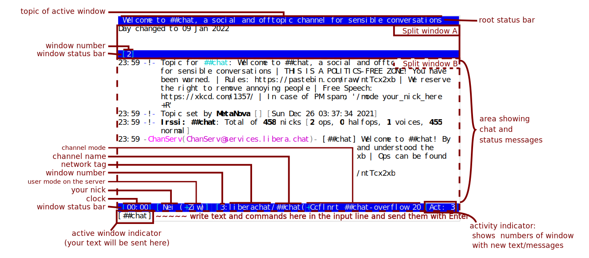
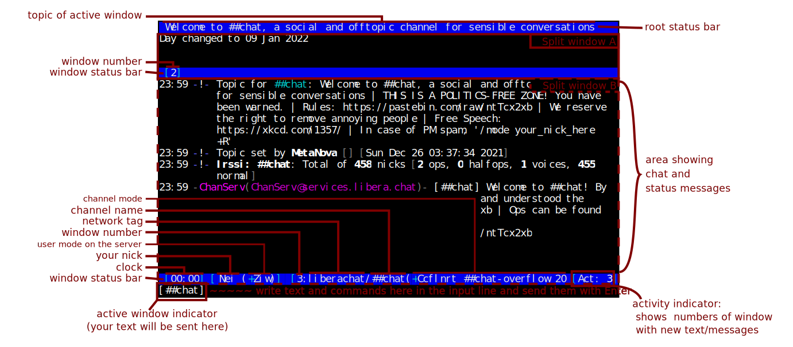

# Minerva AI chat page

Styles inspired in irssi irc chat application

## ROOT STATUS BAR

Topic of active window

## FEED

Area showing chat and status messages

## WINDOW STATUS BAR

### block 1

Clock

### block 2

- Nick
- User mode

### block 3

- Window number
- Network tag
- Channel name
- Channel mode
- Shows numbers of window with new text/messages

## ACTIVE WINDOW INDICATOR

- Your text will be sent here
- Write text and commands here in the input line and send them with Enter
- Chat input
